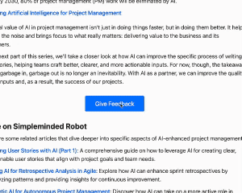

# Zola CTA Modal Shortcode

A self-contained Call-to-Action (CTA) shortcode for [Zola](https://www.getzola.org/) static sites. Creates an accessible, customizable button that opens a modal feedback form.



## Features

- 🎯 Self-contained shortcode with HTML, CSS, and JavaScript
- 📱 Fully responsive design
- 🎨 Customizable theming with CSS variables
- 🌓 Dark mode support
- ♿ Accessibility-focused
- 🤖 Spam protection (reCAPTCHA + honeypot)
- 📨 Built-in Netlify Forms integration

## Installation

1. Copy `cta.html` to your Zola site's `templates/shortcodes/` directory:

```bash
mkdir -p templates/shortcodes
cp cta.html templates/shortcodes/
```

2. If using Netlify Forms, ensure your `netlify.toml` has forms enabled:

```toml
[build]
  publish = "public"
  command = "zola build"

[forms]
  feedback-form = true
```

## Usage

Add the shortcode to any Markdown page:

```markdown
{{ cta() }}
```

### Customization

The shortcode accepts optional parameters:

```markdown
{{ cta(button_text="Give Feedback", title="Share Your Thoughts") }}
```

| Parameter | Default | Description |
|-----------|---------|-------------|
| button_text | "Share Your Thoughts" | Text displayed on the CTA button |
| title | "Feedback Form" | Title shown in the modal header |

### Styling

The shortcode uses CSS custom properties for easy theming:

```css
:root {
  --cta-primary-color: #007bff;
  --cta-hover-color: #0056b3;
  --cta-text-color: white;
  /* ... other variables ... */
}
```

## Using Different Form Processors

While this shortcode comes configured for Netlify Forms, you can modify it to work with any form processing service:

1. Remove Netlify-specific attributes from the form:
   - `data-netlify`
   - `data-netlify-recaptcha`
   - `data-netlify-honeypot`

2. Add your form processor's endpoint:

```html
<form action="https://your-form-processor.com/endpoint" method="POST">
```

1. Adjust form fields as needed for your backend service

## Accessibility

This shortcode follows WCAG 2.1 guidelines:

- Proper ARIA attributes
- Keyboard navigation support
- Focus management
- Screen reader friendly

## Contributing

Contributions are welcome! Please feel free to submit a Pull Request.

1. Fork the repository
2. Create your feature branch (`git checkout -b feature/AmazingFeature`)
3. Commit your changes (`git commit -m 'Add some AmazingFeature'`)
4. Push to the branch (`git push origin feature/AmazingFeature`)
5. Open a Pull Request

## License

Distributed under the MIT License. See `LICENSE` for more information.

## Acknowledgments

- Built for the [Zola](https://www.getzola.org/) static site generator
- Uses [Netlify Forms](https://www.netlify.com/products/forms/) for form processing
- Inspired by accessible modal patterns from [WAI-ARIA Authoring Practices](https://www.w3.org/WAI/ARIA/apg/patterns/dialog-modal/)
